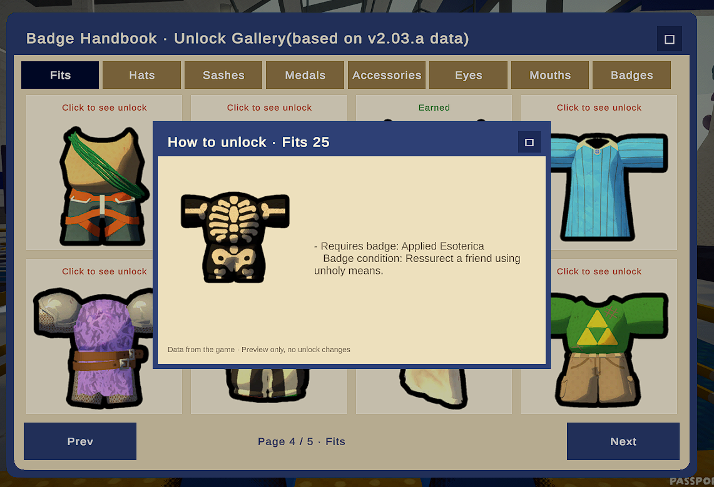
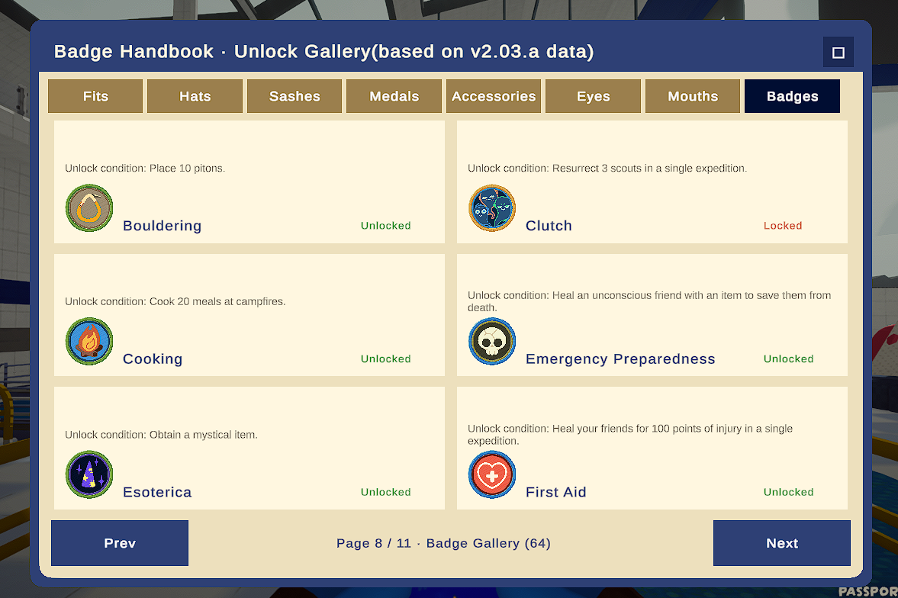
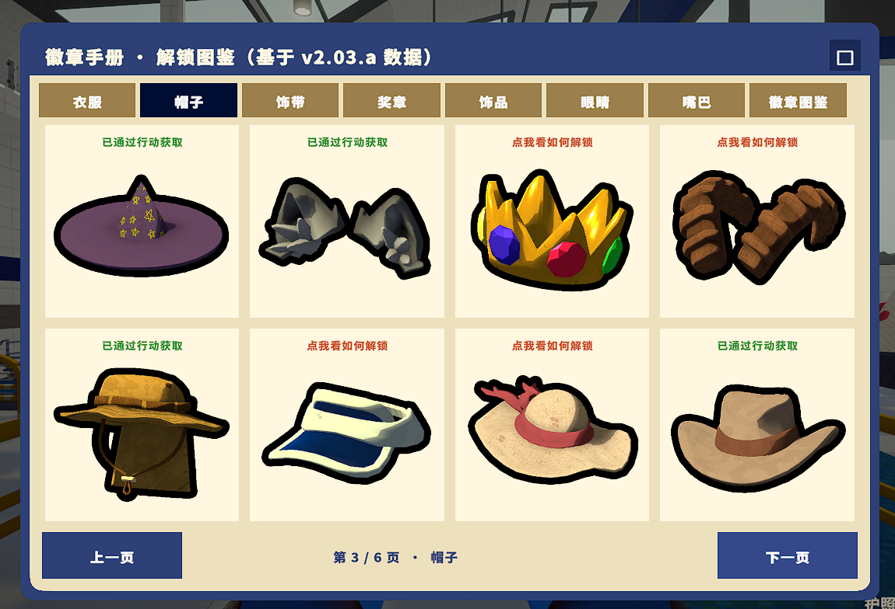
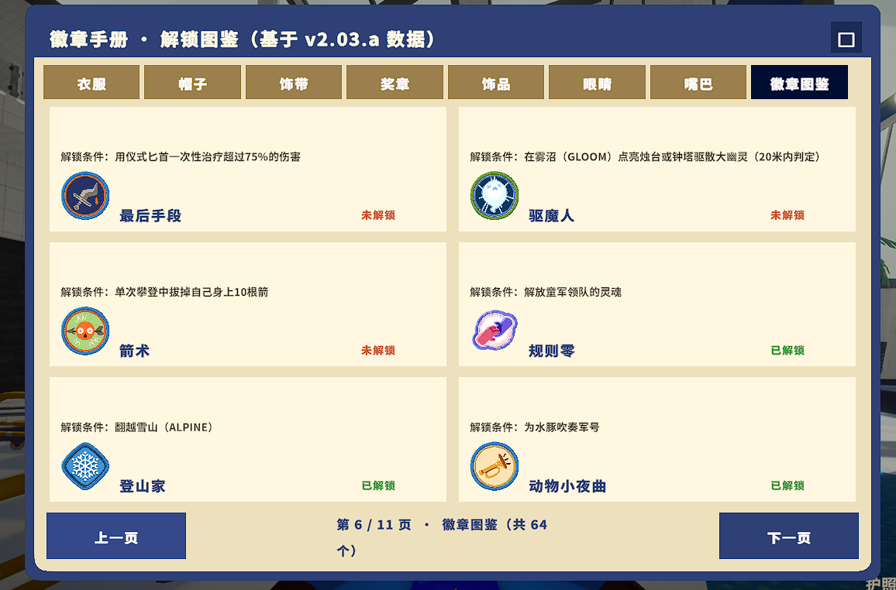

# Peak Badge Handbook 徽章手册

一款让您自由查看徽章解锁条件的 PEAK 模组。

有些想要的服饰或装饰不知如何解锁？在徽章手册中可以找到对应解锁条件！
徽章手册同时记录了您已解锁/未解锁的服饰，更方便查看您的收集进度。

> **AI 生成声明**：本模组由 AI 纯生成，特此声明。
>
> **AI-Generated Notice**: This mod was purely generated by AI.

---

## 安装

**方式一：雷霆下载器（推荐）**

使用 Thunderstore Mod Manager 直接搜索本模组并安装（前提：已安装 BepInEx 框架）。

**方式二：手动安装**

1. 本模组需要 BepInEx 框架，请在雷霆商店页或 Mod Manager 中获取 BepInExPack_PEAK。
2. 将 BepInExPack_PEAK 文件夹下的 `BepInEx`、`.doorstop_version`、`doorstop_config.ini`、`winhttp.dll` 四份文件放入游戏根目录（通常位于 `steamapps\common\PEAK`），与游戏 exe 放在一起。启动一次游戏后退出。
3. 将本模组的 `peak-badge-handbook` 文件夹拖入 BepInEx 目录下的 `plugins` 文件夹中，即可完成安装。

---

## 功能

- 进入游戏大厅后按 **F6**（默认键，可在 config 中调整）即可打开徽章手册 UI。
- 使用鼠标点击，查看未解锁、已解锁的服饰，或是浏览全部徽章。

---

## 配置

觉得字体太小？可在 config 文件夹中找到本模组生成的 `.cfg` 配置文件，调整 `UiScale` 值，UI 界面、字体、栏目框会一起放大或缩小。

---

## 兼容性

本模组为只读界面模组：不修改解锁、换装、存档与成就进度，纯查看用途。

---

## 问题反馈

如遇此模组的 Bug 等问题，请在 GitHub 的 Issue 提交你的问题：
https://github.com/BlueLoongGulu/peak-badge-handbook/issues

或到 Bilibili 站点私信我（蓝龙咕噜）：
https://space.bilibili.com/86295309

---

## 开源

MIT License — 源码见 GitHub 仓库。

---

---

# Peak Badge Handbook

A PEAK mod that lets you freely browse badge unlock conditions.

Want to know how to unlock that outfit or accessory? Find the answer in the Badge Handbook!
It also shows which cosmetics are unlocked (and which are not), so you can track your collection progress.

> **AI-Generated Notice**: This mod was purely generated by AI.
>
> **AI 生成声明**：本模组由 AI 纯生成，特此声明。

---

## Installation

**Option 1: Thunderstore Mod Manager (recommended)**

Search for this mod in Thunderstore Mod Manager and install it (requires the BepInEx framework).

**Option 2: Manual install**

1. This mod requires BepInEx — grab BepInExPack_PEAK from the store page or Mod Manager.
2. Put the 4 files from BepInExPack_PEAK (`BepInEx`, `.doorstop_version`, `doorstop_config.ini`, `winhttp.dll`) into the game root folder (usually `steamapps\common\PEAK`), next to the game exe. Launch the game once, then exit.
3. Drag this mod's `peak-badge-handbook` folder into the `plugins` folder inside your BepInEx directory. Done!

---

## Features

- Press **F6** in the game lobby to open the handbook UI (default key; rebindable in config).
- Click to inspect locked or unlocked cosmetics, or browse all badges.

---

## Config

Font too small? Open the mod's `.cfg` file in the config folder and adjust `UiScale` — the UI, fonts, and panels scale together.

---

## Compatibility

This is a read-only UI mod: it does not modify unlocking, cosmetics, saves, or achievement progress.

---

## Feedback / Bug Reports

Found a bug or have a suggestion? Please open an issue on GitHub:
https://github.com/BlueLoongGulu/peak-badge-handbook/issues

---

## Open Source

MIT License — source code on GitHub.
